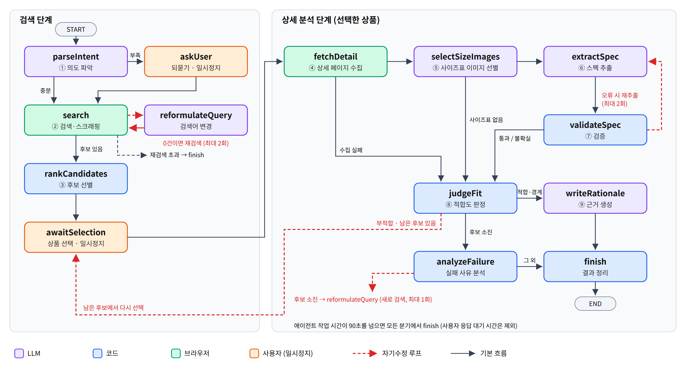

# 글로벌 쇼핑 의사결정 지원 에이전트

멀티모달 LLM 및 에이전틱 엔지니어링 기반의 글로벌 쇼핑 의사결정 지원 시스템 (2026 캡스톤디자인).

타오바오·티몰·1688 의류 상품의 **이미지로 된 사이즈표**를 읽어 사용자의 키·몸무게에 맞는지 판정하고, 판정 근거를 한국어로 설명하는 Chrome 확장 프로그램입니다.

## 구성

| 폴더 | 내용 |
|---|---|
| `app/` | Chrome 확장(사이드패널) + LangGraph.js 에이전트 실행 그래프. 실행 방법은 [app/README.md](app/README.md) |
| `에이전트/` | 에이전트 그래프 설계서(v0.3), 그래프 그림 |
| `스키마/` | 사이즈표 추출 스키마(Zod, v1.2)와 정규화 규칙 |
| `사이즈표/` | 수집한 사이즈표 이미지 25장, 출처 목록, 정답 라벨(개발용 5장 `라벨_초안`, 테스트용 20장 `라벨_테스트`) |
| `POC/` | 추출 정확도 POC 스크립트(Gemini API)와 결과 |

## 에이전트 흐름



1. 한국어 요청을 구조화된 조건으로 해석 → 도메인 용어 사전으로 중국어 검색어 생성 → 검색 → 상위 3개 후보 제시
2. 사용자가 고른 상품의 상세 페이지에서 사이즈표 이미지 선별 → 스펙 추출(LLM) → 검증(코드)
3. 키·몸무게와 대조해 적합 / 경계 / 부적합 판정 → 근거 생성

자기수정 루프: 검색 결과 없음 → 검색어 바꿔 재검색(최대 2회), 검증 실패 → 오류를 알려 재추출(최대 2회), 부적합 → 남은 후보에서 사용자 재선택, 후보 소진 → 새로 검색(최대 1회). 에이전트 작업 시간 90초(사용자 응답 대기 제외)를 넘으면 중간 결과로 종료합니다.

## 현재 상태 (2026년 10월 5일, 2학기 3주차)

- [x] 사이즈표 25장 수집, 스키마 v1.2, 정답 라벨 25장
- [x] 추출 POC: 개발용 4장 268개 항목 100% (테스트셋 20장 측정 예정)
- [x] 에이전트 그래프(노드 14개) 구현, 시나리오 테스트 15개 통과, Chrome 확장에서 실행 확인 (노드는 아직 가짜 함수)
- [ ] 노드 실제 구현 (LLM 호출 계층, 검색, 스펙 추출·검증, 판정)
- [ ] 정확도 측정, 사용성 평가(4인)

## 빠른 시작

```bash
cd app
npm install
npm test         # 시나리오 테스트
npm run build    # dist/ 를 chrome://extensions 에서 '압축해제된 확장 프로그램'으로 로드
```

POC를 실행하려면 저장소 최상위에 `gemini_key.txt`(Gemini API 키 한 줄)를 만들고 `POC/실행방법.txt`를 참고하세요. 이 파일은 `.gitignore`에 포함되어 올라가지 않습니다.

## 데이터 출처

`사이즈표/`의 이미지는 타오바오·티몰 상품 페이지에서 연구 목적으로 수집한 것이며, 저작권은 각 판매자에게 있습니다. 상품 주소는 `사이즈표/출처.csv`에 있습니다.
